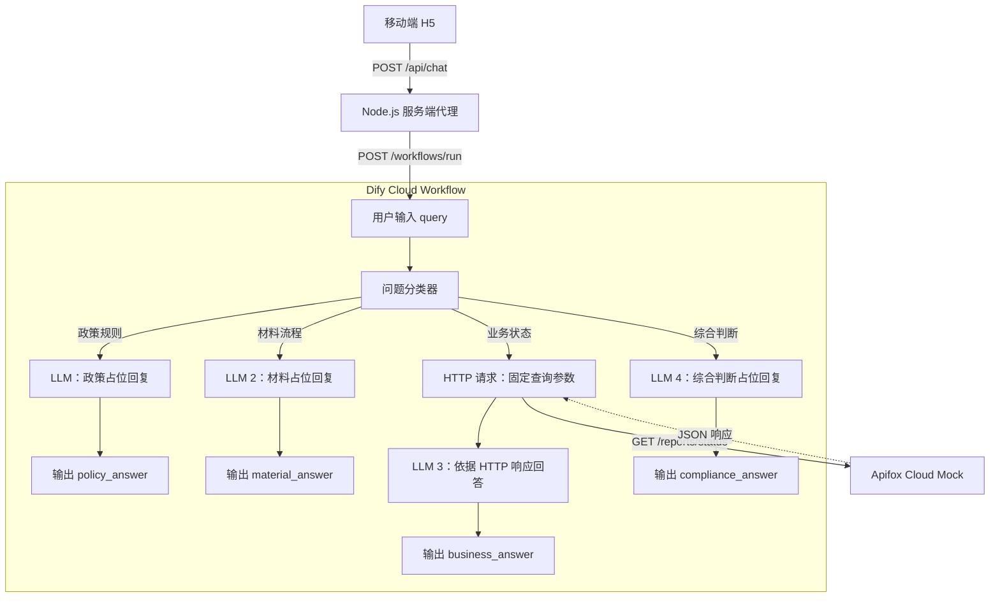

# 矿业智询（Mining AI Assistant）

面向矿业/盐湖监管场景的 AI 智能问答助手。

**[打开公网 Demo](https://mining-ai-assistant.onrender.com/)** · 手机或电脑浏览器均可体验

先点击 **“我们矿山的储量年报提交了吗？”**，查看查询状态与回答。该 Case 已完成公网端到端验证，演示结果为“已提交。”。当前业务数据均为 **Mock 虚构演示数据**，未接入真实监管系统；提交状态不代表审批通过。

## 当前 MVP 能力

| 能力 | 当前实现 |
| --- | --- |
| 移动端 H5 问答 | 示例问题、自由输入、聊天展示、加载状态、防重复提交和错误提示 |
| 业务状态查询 | Dify 调用 Apifox 云端 Mock API，LLM 根据返回数据回答储量年报提交状态 |
| 政策/监管问答、材料/流程问答 | 已实现问题分类与分支路由，目前仅返回进入分支的提示，尚未提供知识库问答 |
| 综合判断 | 已有分类分支与占位回复，尚未实现逾期、合规或资料齐全性判断 |

当前查询固定使用 `mine_001`、`2026`、`储量年报`，尚不能根据自然语言切换矿山、年度或报告类型。每次提问独立运行，不保留多轮对话上下文。

## 产品与技术架构

前端采用原生 HTML/CSS/JavaScript，Node.js 同时提供页面与服务端代理。下图按当前代码及 [Workflow DSL](dify/mining-ai-assistant.yml) 绘制：



各分支输出经服务端代理返回 H5。Dify API Key 仅在服务端读取，不交给浏览器。当前未使用 Flask、数据库或 RAG 检索节点。

## Dify Workflow

主工作流 [dify/mining-ai-assistant.yml](dify/mining-ai-assistant.yml) 已纳入 Git 版本管理；`dify/workflow-v1.yml` 为早期版本。

- **用户输入 → 问题分类器**：接收必填 `query`，区分政策规则、材料流程、业务状态和综合判断四类意图。
- **业务状态分支**：HTTP 节点查询 Mock API；LLM 3 读取响应体，按 `status` 回答，提示词要求不得编造接口未返回的信息；输出 `business_answer`。
- **其他三个分支**：各自经过 LLM 和输出节点，目前仅验证分类路由，回复分支提示与用户问题。

代表 Case：**“我们矿山的储量年报提交了吗？” → 业务状态分支 → Mock 返回“已提交” → 页面显示“已提交。”**

复现时在 Dify Cloud 导入主 DSL，配置其 OpenRouter 模型供应商与可访问的 Mock 接口后发布 Workflow，再将应用 API 配置到服务端。DSL 不包含模型或应用密钥。

## Apifox Mock

MVP 使用 Mock 模拟“查询某矿山某年度某类报告提交状态”的业务接口，便于在真实监管接口接入前验证产品交互和完整调用链路。

接口形态：`GET /reports/status`，参数为 `mine_id`、`year`、`report_type`。当前 Workflow 固定查询 `mine_001 / 2026 / 储量年报`，已验证的演示状态为 `已提交`；此处不展开云端 Mock 完整地址。

仓库另有独立的 [本地 Mock API](mock-api/README.md) 与 [示例数据](mock-api/data.json)：储量年报“已提交”、年度资源开发利用报告“未提交”、卤水动态监测年报“已提交”。这些本地记录不表示公网 Workflow 已支持多报告查询；当前公网链路使用 Apifox Cloud Mock。

## 本地运行

需要 **Node.js 22 或以上**。项目没有 `package.json`，使用 Node.js 内置模块，无需安装依赖或打包。

1. 在仓库根目录，将 `.env.example` 复制为 `.env`（已有配置时不要覆盖）。
2. 编辑 `.env`，填入自己的已发布 Dify Workflow 应用配置：

```dotenv
DIFY_BASE_URL=https://api.dify.ai/v1
DIFY_API_KEY=YOUR_DIFY_APP_API_KEY
PORT=5174
```

`DIFY_BASE_URL` 与 `DIFY_API_KEY` 为必填；Base URL 使用应用 API 页面提供的地址，不包含 `/workflows/run`。`PORT` 可选，不设置时默认为 `5173`，示例配置为 `5174`。系统环境变量优先，修改后需重启。

3. 在仓库根目录启动：

```sh
node app/preview.mjs
```

按上述示例配置访问 [本地页面](http://localhost:5174)，点击代表问题验证；停止服务按 Ctrl+C。`.env` 和 `.env.*` 已被 `.gitignore` 忽略，仅保留不含凭据的 `.env.example`。

代理自动检查（模拟 Dify 响应，不代表云端联通验证）：

```sh
node --test app/dify.test.mjs
```

如需单独体验本地 Mock，可运行 `node mock-api/server.js`；它不是启动 H5 的必要步骤。更多说明见 [应用运行指南](app/README.md)。

## 部署

公网 Demo 已部署至 **Render**：提供 H5 页面及 Node.js 代理，以仓库根目录为工作目录，启动命令为 `node app/preview.mjs`。服务监听 `0.0.0.0`，读取平台的 `PORT`；在 Render 环境变量中配置 `DIFY_BASE_URL` 和 `DIFY_API_KEY`，不要上传本地 `.env`。

**Render → Dify Cloud → Apifox Cloud Mock**：Dify Cloud 运行已发布工作流并调用模型，业务状态分支访问 Apifox 云端演示接口。此前已完成公网代表 Case 验证。

## 下一步

- 从问题中提取并校验 `report_type`、矿山与年度，替换固定查询参数。
- 接入多报告查询，汇总提交情况与缺项。
- 接入政策及办事指南 RAG，为政策、材料问答提供可追溯依据。
- 结合规则与业务数据实现综合判断。
